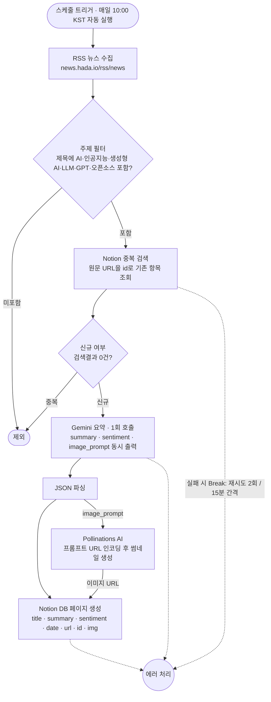

# 📰 AI 테크 뉴스 요약 및 인사이트 큐레이션 자동화 시스템
- [과제 내용](subject.md)
- [협업 방법](CONTRIBUTE.md)

## 1. 프로젝트 개요
본 프로젝트는 매일 쏟아지는 방대한 IT/테크 뉴스 속에서, AI 기술에 관심 있는 독자들을 위해 핵심 'AI 테크 트렌드' 기사만을 자동으로 선별하고 요약하여 데이터베이스에 축적하는 무인 자동화 파이프라인입니다.

* **사용된 자동화 툴:** Make — [공유 시나리오](https://eu1.make.com/public/shared-scenario/luIffNBn4Je/integration-rss)
* **생성형 AI 모델:** Google Gemini API (Gemini Flash Latest 모델 적용 / OpenAI GPT-4o 수준의 최신 LLM)
* **데이터 저장 도구:** Notion [workspace](https://app.notion.com/p/Ford-AI-gray-beard-38ca042c32f681fc84eecbe5a71829b7?source=copy_link)
* **이미지 생성 도구:** Pollinations AI (API Key 불필요, 프롬프트 URL 인코딩 방식, 무료)

---

## 2. 자동화 워크플로우 아키텍처
본 시스템은 사람의 개입 없이 **매일 오전 10:00 (Asia/Seoul)**에 자동 실행되며, 다음과 같은 단계로 작동합니다.

1. **데이터 수집 (RSS):** 공식 RSS 피드를 제공하는 테크 뉴스 사이트에서 최신 기사를 수집합니다. (저작권 침해 및 불법 크롤링 방지)
2. **주제 필터링 (Filter):** 수집한 기사 중 제목에 'AI 관련 키워드'(AI·인공지능·생성형 AI·LLM·GPT·오픈소스)가 포함된 기사만 다음 단계로 통과시킵니다.
3. **중복 검사 (Notion Search):** 통과한 기사의 원문 링크(URL)를 고유 식별자(Key)로 삼아 노션 DB를 검색하여, 이미 저장된 기사이면 중단하고 검색 결과가 0건(신규)인 기사만 다음 단계로 보냅니다.
4. **AI 가공 (Google Gemini AI):** Gemini 모델이 원문을 분석하여 ① 3줄 핵심 요약, ② 기사 감성(긍정/부정/중립), ③ 썸네일 생성용 영문 프롬프트를 JSON 포맷으로 구조화하여 1회 호출만으로 동시 출력합니다.
```json
다음 기사 내용을 분석해서 답변해 줘.
단, 마크다운 기호(```json 등)나 다른 인사말은 절대 쓰지 말고, 반드시 아래의 순수 JSON 형식으로만 출력해야 해.

{
  "summary": "여기에 핵심 내용 딱 3줄 요약 (각 줄은 - 로 시작하고 줄바꿈 적용)",
  "sentiment": "긍정, 부정, 중립 중 택 1",
  "image_prompt": "이 기사를 대표할 수 있는 썸네일 이미지를 AI로 그리기 위한 영문 프롬프트 1문장"
}
```
5. **데이터 파싱 (Parse JSON):** AI가 출력한 JSON 데이터를 각 속성별 변수로 분리합니다.
6. **자동 저장 (Notion):** 제목, AI 요약문(텍스트), 원문 링크(URL), 발행일시(Date), 감성 분석 결과(태그), 썸네일 이미지(파일)를 노션 DB의 각 속성에 알맞게 매핑하여 최종 저장합니다. 썸네일 이미지의 경우 파싱된 영문 프롬프트를 URL 인코딩하여 Pollinations AI에 요청(GET)하고 썸네일 이미지를 생성 후 저장.




### import
두 가지 방법으로 import 가능
1. **Make 공유 링크:** [공유 시나리오 링크](https://eu1.make.com/public/shared-scenario/luIffNBn4Je/integration-rss) 로 본인 Make 계정으로 시나리오 전체를 복제
2. **blueprint 파일:** 동일한 시나리오를 [`make_blueprint.json`](make_blueprint.json)으로 export 해 레포에 포함했음, Make 시나리오 편집기의 `⋯`(More) 메뉴 → **Import Blueprint**로 이 파일을 업로드하면 똑같이 복원됩니다.

두 방법 모두 위 다이어그램의 시나리오(모듈·연결·필터·스케줄)를 복원하지만, **API 키·토큰은 어느 쪽에도 포함되지 않습니다**. 따라서 import 후 **Notion·Gemini Connection은 본인 계정으로 다시 연결**해야 정상 동작합니다.

---

## 3. 최종 결과물 (Notion 데이터베이스)

워크플로우가 성공적으로 실행되어 노션 데이터베이스에 자동 적재된 최종 산출물 화면입니다.


**[데이터베이스 속성(Column) 설명]**
*   **`title` (제목):** RSS에서 수집한 기사의 원문 제목입니다.
*   **`url` (링크):** 해당 기사의 원문으로 이동할 수 있는 고유 주소입니다.
*   **`date` (발행일):** 기사가 퍼블리싱된 날짜입니다.
*   **`summary` (요약):** Gemini AI가 JSON 포맷으로 응답한 데이터를 파싱하여, 각 불릿 포인트(`-`)로 정리한 3줄 요약 텍스트입니다.
*   **`sentiment` (감성):** 기사의 뉘앙스를 AI가 분석하여 '긍정', '부정', '중립' 중 하나의 Select 태그로 자동 매핑하여 시각화했습니다.
*   **`img` (이미지):** Pollinations AI를 통해 자동 생성된 썸네일 이미지의 URL이 저장된 공간입니다. (노션 설정에 따라 표 갤러리 뷰에서 커버로 활용 가능합니다.)
*   **`id` (고유값):** 중복 저장을 방지하기 위해 사용되는 고유 키 값으로, 기사 원문의 URL을 할당하여 무결성을 유지합니다.

---

## 4. 팀 역할 및 개인별 작업 요약
### Workflow 자동화
- **김재은:** Make flow 설계 환경 세팅 최종 연동, 요약 프롬프트, notion 연결 url/date/요약/감정/썸네/id 기반, pollinations 연결
- **박정욱:** RSS 수집 소스 선정
- **박찬웅:** notion 연결 테스트, 요약/url/guid 기반
### API
- **조민기:** 무료 API 대체 API 조사
- **이태규:** n8n 테스트, 무료 LLM/이미지 API 조사

---

## 5. 주제 필터링 기준 (키워드/태그 목록) 및 선택 이유
* **타겟 도메인:** AI 기술 트렌드 및 테크 인사이트 큐레이션
* **필터링 키워드 (OR 조건):** `AI`, `인공지능`, `생성형 AI`, `LLM`, `GPT`, `오픈소스`
* **선택 이유:** 인공지능 기술은 매일 새로운 모델과 서비스가 쏟아질 정도로 발전 속도가 매우 빠릅니다. AI에 관심 있는 타겟 독자(개발자, 기획자, 얼리어답터 등)가 정보의 홍수 속에서 피로감을 느끼지 않도록, 범용적인 IT 뉴스가 아닌 핵심 AI 테크 기술 및 트렌드 기사만 선별할 필요가 있습니다. 이를 위해 LLM, 생성형 AI 등과 관련된 핵심 키워드를 필터링 기준으로 채택하여, 최신 기술 동향을 놓치지 않고 매일 핵심만 파악할 수 있는 고품질 자동화 큐레이션 시스템을 구축하였습니다.

---

## 6. 안정성 및 에러 처리 정책
* **중복 방지 정책:** 요약 AI를 호출하기 전, Notion Search 모듈을 통해 'ID'가 DB에 존재하는지 검사합니다. 검색 결과가 0건일 때만 AI 호출이 진행되므로 불필요한 API 비용 발생을 원천 차단했습니다.
* **에러 핸들링 모듈:** `Retry` (재시도)
* **적용 구간:** 외부 통신이 발생하는 `Google Gemini AI` 모듈 및 `Notion` 저장 모듈
* **세부 정책 및 선택 이유:** API 호출 시 발생하는 대부분의 오류는 일시적인 네트워크 지연(Timeout)에 의한 것입니다. 에러 발생 시 최대 **2회**까지만 자동 재시도하도록 상한을 설정하여 데이터 유실을 방지함과 동시에, 무한 루프에 빠져 불필요한 비용이 발생하지 않도록 안정성을 확보했습니다.

---

## 7. 보안 및 제약 사항 준수
* **저작권 준수:** RSS 피드가 제공되지 않는 사이트를 강제 크롤링하지 않고, 합법적인 RSS 프로토콜만을 사용했습니다.
* **비용 최소화:** 기사 1건당 AI 호출을 1회로 통합(요약+감성+프롬프트 추출)하여 API 토큰 사용량을 최소화했습니다.
* **API 키 보안:** Make의 비공개 Connection(Vault) 시스템을 통해 API 키를 안전하게 보관하였으며, 산출물 캡처 시 API 키 및 토큰 문자열이 노출되지 않도록 마스킹 처리를 완료했습니다.

---

## 8. 부가 요소 설명 (예비/백업 플랜)
아래 두 도구(`openai-oauth proxy`, `image_proxy`)는 **실제 운영 워크플로우에는 투입되지 않은 예비 장치**입니다. 프로젝트 초기, 다음 두 가지 리스크에 대비해 미리 구축해 두었습니다.

* **LLM 텍스트 토큰 고갈 대비:** 개발/테스트를 반복하다 Gemini 무료 한도가 소진될 경우, 본인 ChatGPT 구독을 OpenAI 호환 텍스트 API로 노출하여 호출당 과금 없이 대체할 수 있도록 준비했습니다.
* **무료 이미지 생성 API 부재 대비:** 썸네일 생성에 쓸 무과금 이미지 API를 찾지 못할 경우를 대비해, ChatGPT 구독의 내장 이미지 생성 기능을 OpenAI 호환 API로 감싸 두었습니다.

이후 **Pollinations AI**(무료·API Key 불필요)를 확보해 이미지 경로가 해결되었고 텍스트 역시 Gemini 무료 한도로 충분했기 때문에, 본 도구들은 실제 시나리오에는 사용하지 않고 **무료 한도가 막혔을 때 ChatGPT 구독으로 전환하는 비상 경로**로만 남겨 두었습니다.

* [openai-oauth proxy](https://github.com/EvanZhouDev/openai-oauth): proxy 서버를 띄우면 ChatGPT(codex) 구독으로 LLM 텍스트 응답을 OpenAI 호환 엔드포인트로 제공합니다. (텍스트 전용이라 이미지 생성은 미지원)
* [image_proxy](image_proxy/README.md): 위 proxy가 이미지 생성을 지원하지 않아, codex 구독의 내장 이미지 생성 기능을 OpenAI 호환 `/v1/images/generations` API로 감싸 별도 제작한 도구입니다.
* 배포 및 실행 방법은 [deployments](deployments/README.md)를 참고하세요.
