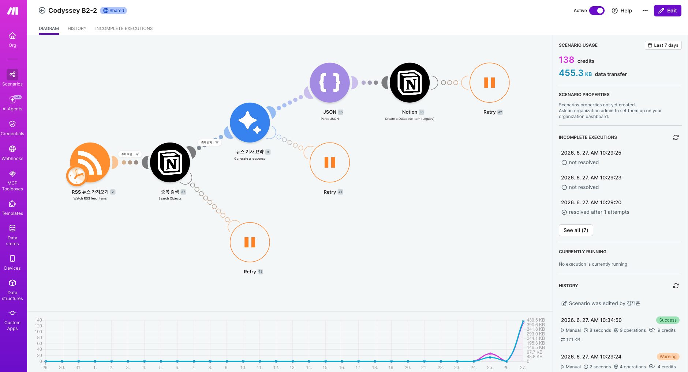
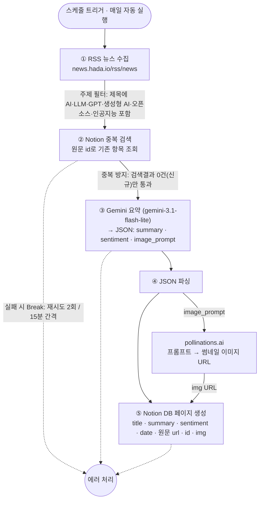

# codyssey_b2_2
- [과제 내용](subject.md)
- [협업 방법](CONTRIBUTE.md)
- [팀 Make Workflow](https://eu1.make.com/2021099/scenarios/6327312/edit)
- [결과 notion](https://app.notion.com/p/Ford-AI-gray-beard-38ca042c32f681fc84eecbe5a71829b7?source=copy_link)

## 팀 작업 요약
- TODO

## 구성 설명
- 

## 필터링 기준
### TODO 키워드/태그 목록
- TODO
### 선택 이유
- TODO

## 에러 처리 정책
- TODO

## 부가 요소 설명
- [openai-oauth proxy](https://github.com/EvanZhouDev/openai-oauth) 이 proxy 서버를 띄워 놓으면 LLM text 응답을 codex 구독을 통해서 api endpoint 로 만들 수 있다, 여기선 image 생성 api 는 제공을 안해서 아래 image_proxy 를 별도로 만듬
- [image_proxy](image_proxy/README.md) image 생성을 codex 구독으로 제공하는 api endpoint 를 만들기 위한 도구
- 자세한 내용은 [deployments](deployments/README.md) 배포 사용 방법을 참고
