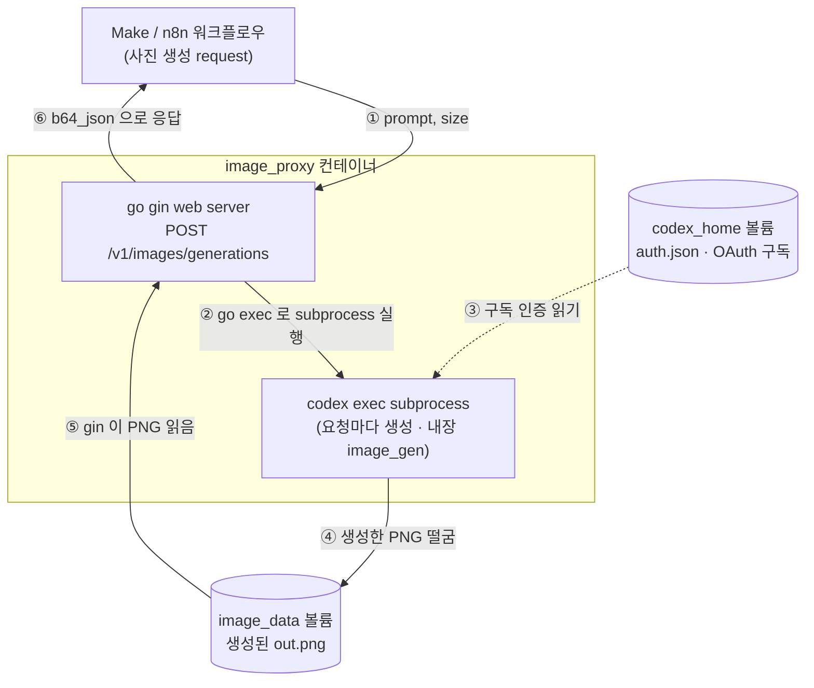

# image_proxy
- 썸네일 이미지 생성 시 무료 툴로 token 제한이 꽤 있어 image 생성을 codex 구독으로 제공하는 api endpoint 를 만들기 위한 보조 도구.
  - image 생성을 최대한 구독하고 있는 codex 를 사용해서 해결하기 위해 만든, api 를 별도로 띄우는 보조 도구
- go gin web server 라이브러리로 웹서버를 띄워 (테스트 시에는 docker 로 로컬에 띄워놓고 테스트) openai api compatiable 한 image_generation api (`/v1/images/generations`) 를 제공하고
  - Make workflow 에서 api image_generation api 를 호출하면
  - go web 서버에서 subprocess 를 go exec command 로 실행해서 `codex exec "이미지 어디에 만들어서 저장해줘"` 같은 형태로 codex 의 내장 이미지 생성도구를 통해 이미지 파일을 생성하고, 이 파일을 web 서버가 다시 읽어서 사용자(Make workflow) 에게 openai api 호환 형태인 b64_json 으로 response 하는 구조
  - codex 구독만 되어있으면 구독 한도 내에서 별도 api 호출당 과금이 없다
- codex 의 oauth 정보(`.codex/oauth.josn`)가 있으면 사용가능, docker 실행시 현재 local 의 `~/.codex/oauth.json` 을 `docker cp` 명령어로 복사해간다 (docker 안으로 복사해 격리시켜 local 파일을 오염시키지는 않음)

## 동작 원리

1. 요청 본문의 `prompt`를 고정 템플릿으로 감싸 `codex exec --dangerously-bypass-approvals-and-sandbox --skip-git-repo-check -C <tmp> "..."` 실행
2. codex 내장 도구가 `<tmp>/out.png`(및 `~/.codex/generated_images/<session>/ig_*.png`)에 이미지 저장
3. 서버(Gin)가 그 PNG를 base64로 `data[0].b64_json`에 담아 OpenAI 형태로 반환 (`size`는 codex 프롬프트 힌트일 뿐, 정확한 출력 크기는 모델이 결정 — 별도 리사이즈 안 함)
4. 인증은 호스트의 `~/.codex/auth.json`(OAuth) 사용

## 설정 (환경변수)
| 변수 | 기본값 | 설명 |
|------|--------|------|
| `IMAGE_PROXY_ADDR` | `127.0.0.1:8080` | listen 주소 |
| `IMAGE_PROXY_API_KEY` | (없음) | 설정 시 `Authorization: Bearer <key>` 요구. 외부 노출 시 필수 |
| `CODEX_BIN` | `codex` | codex 실행 파일 경로 |
| `CODEX_TIMEOUT` | `3m` | 요청당 타임아웃 (예: `90s`) |

## 호출 예시
```bash
curl -X POST http://127.0.0.1:8081/v1/images/generations \
  -H 'Content-Type: application/json' \
  -d '{"prompt":"a flat blue square on white background, minimal","size":"1024x1024"}'
# -> {"created":..., "data":[{"b64_json":"<PNG base64>"}]}
```
응답을 파일로:
```bash
curl -s -X POST http://127.0.0.1:8081/v1/images/generations \
  -H 'Content-Type: application/json' \
  -d '{"prompt":"news thumbnail about AI agents","size":"512x512"}' \
| python3 -c 'import sys,json,base64;open("out.png","wb").write(base64.b64decode(json.load(sys.stdin)["data"][0]["b64_json"]))'
```

## 엔드포인트
- `POST /v1/images/generations` — body `{"prompt": "...", "size": "WxH"}`. `size`는 `WxH` 형식(선택)이며 codex에 best-effort 힌트로 전달(실제 출력 크기는 모델이 결정, 정확한 크기 보장 X). `n`/`model`/`response_format`은 수용하되 무시. 응답은 OpenAI 형태 `{created, data:[{b64_json}]}`
- `GET /healthz` — `200 ok`

## 보안 / 운영 주의
- 기본 bind는 `127.0.0.1`(로컬 전용). 외부(n8n 원격/Make 클라우드)에서 호출하려면 노출이 필요하고, 그때는 **`IMAGE_PROXY_API_KEY`를 반드시 설정**하고 가능하면 HTTPS 터널/리버스 프록시 뒤에 둔다
- `codex`는 범용 에이전트라 bypass 모드에서 shell 권한을 갖는다. 로컬에서 실행하지 말고, docker 에 올려서 실행하자. 가능하면 워크플로우에서 LLM이 정제한 짧은 프롬프트만 넘기자
- `~/.codex/auth.json`(OAuth 토큰)을 비공개로 관리. 토큰 만료 시 `codex login` 재실행
